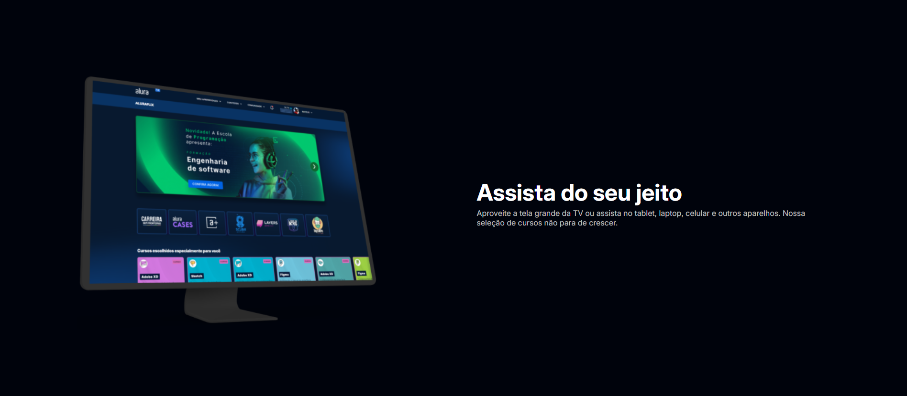
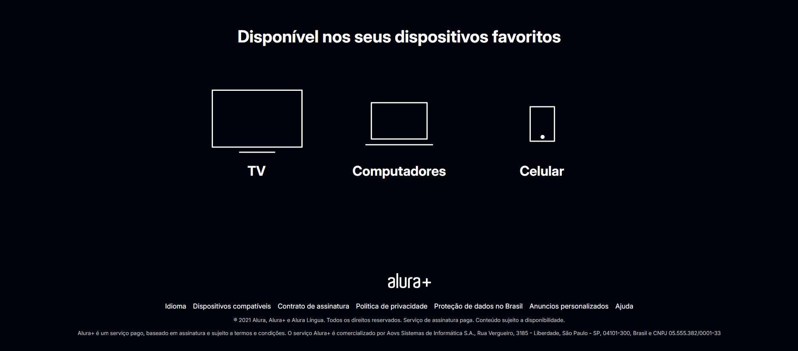

# Alura Plus

Projeto desenvolvido durante o curso "Praticando HTML/CSS" da Alura.
Aqui a página do serviço Alura Plus a partir do modelo disponibilizado no Figma, trabalhando principalmente estruturação semântica, responsividade inicial e organização com Flexbox.

### 🔧 Tecnologias utilizadas

- HTML
- CSS
- Flexbox
- Figma

### 📸 Projeto

### 🚀 O que eu aprendi

Montar layout com flex containers e flex items

Usar classes utilitárias para organização

Criar seções com hierarquia clara

Importar fontes e ajustar estilos globais

### 📝 Como visualizar

